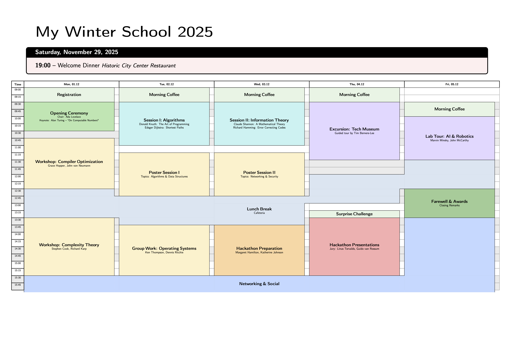

# PythonAgendaBuilder
Vibe coded python module to build a latex agenda. It supports rendering either with `tikz` or with `tabular`. Main file can be used to create an Agenda by parsing a csv file with events.

A csv file with the following columns is expected `EVENT_TITLE,EVENT_START,EVENT_END,EVENT_TEXT,EVENT_TEXT_SIZE,EVENT_ID,EVENT_COLOR,IS_OPEN_ENDED,IS_SPECIAL`. If no header is provided, the order must be as specified. `EVENT_COLOR` can be a hex value or a color_id (automatically picks a color from a palette) which allows assigning the same color to multiple events. See also [example/csv/my_agenda.csv](example/csv/my_agenda.csv) for reference.

Running the example main file outputs the [LaTeX code](example/tex/example_tikz.tex) for the [pdf](example/pdf/example_tikz.pdf) of the agenda. If one does not want to use the 'tikz' package one can use the `--legacy` option. To save the output directly to a file use `--file <filename>`.

Image of Example PDF with tikz rendering:

Image of Example PDF with table rendering:

